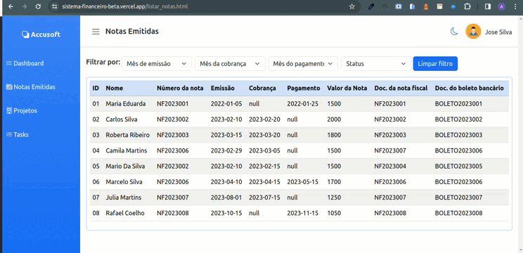

## Sistema Financeiro - Teste Técnico TechNation - Frontend Jr

## Informações
 - Nome: André Lucas
 - E-mail: andrelucca99@gmail.com
 - [Linkedin](https://www.linkedin.com/in/andre-lucas20/)

## Ferramentas utilizadas

  - `HTML5` | `CSS3` | `JAVASCRIPT` | `BOOTSTRAP` | `CHART.JS`

  - Versões:
    - Bootstrap: `https://cdn.jsdelivr.net/npm/bootstrap@5.3.3/dist/js/bootstrap.bundle.min.js`
    - Chart.js: `https://cdnjs.cloudflare.com/ajax/libs/Chart.js/2.5.0/Chart.min.js`
  
  - Visualize o projeto: [link](https://sistema-financeiro-beta.vercel.app/)

## Instruções básicas para rodar o projeto na sua maquina:

- Clone esse repositório com a chave SSH.
  - `git clone git@github.com:andrelucca99/sistema_financeiro.git`

- Entre a pasta do repositório que você acabou de clonar e depois abra no seu editor de código. Nesse exemplo vou usar Visual Studio Code:
  - `cd sistema_financeiro`
  - `cd code .`
  - Depois suba o projeto com a extesão `live server` e pronto.

- Caso queira fazer modificações fique a vontade.

## Sobre o projeto

  Esse projeto foi desenvolvido em duas páginas. Página de Dashboard, onde usuários conseguem filtar os dados das notas fiscais por: Mês, Trimestre e Ano e logo abaixo também conseguem ver dois gráficos sobre: Taxa de inadimplência e Evolução da inadimplência mês a mês.

## Layout - Página Dashboard 

  E na segunda página os usuários conseguem visualizar uma lista de notas fiscais, apresentadas em uma tabela com os dados de cada nota. Além de poderem fazerem filtros de buscas por mês de: emissão, cobrança, pagamento e o status da nota fiscal.

## Layout - Página Lista de notas fiscais

## Ponto de melhoria no projeto

  Descobrir, por que os gráficos só carregam se clicar duas vezes em cima do quadrado azul da legenda ou quando aperta f12 do teclado.

